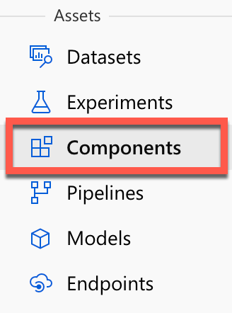
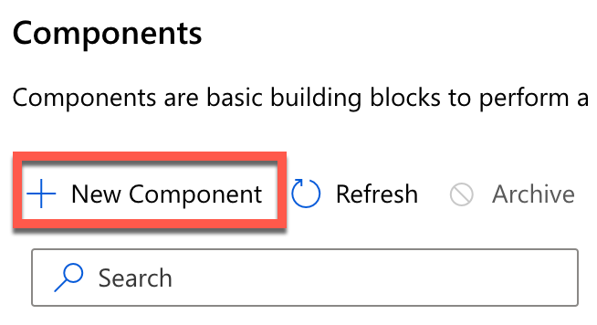
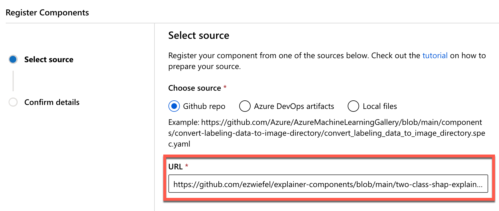
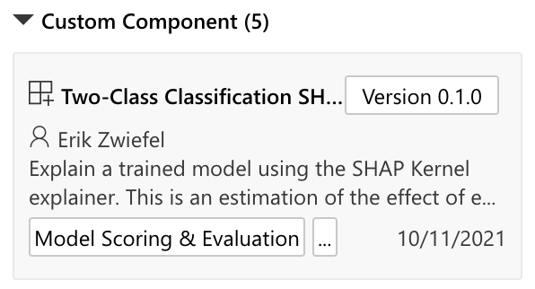

<!--
 Copyright (c) 2021 Microsoft

 This software is released under the MIT License.
 https://opensource.org/licenses/MIT
-->

# SHAP Kernel Explainer Component for Azure ML Designer

Creates (and uploads to AML) a model explaination for two-class classification models using the SHAP KernelExplainer from the [interpret-community](https://pypi.org/project/interpret-community) Python package.

To add this to your AML Designer Workspace:
1. Under "Assets" in the left-side menu, select "Components" 
 
1. Next, click "New Component" 
 
1. Finally, in the Register Components screen, choose Github Repo and enter the url `https://github.com/ezwiefel/explainer-components/blob/main/two-class-shap-explainer/explainer_module.yml`  

After these steps, you'll be able to find a new module under the 'Custom Components' area in AML Designer.
